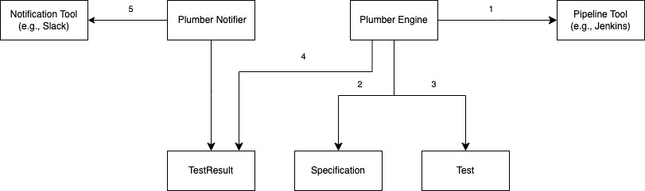

# Plumber-Bot

A general end-to-end pipeline testing bot that supports various CI/CD pipeline tools.

# Why do we need a bot for testing pipelines?

Can't we just run the pipeline with tools like Curl and receive the results through alerts? Why do we need a bot for
this?

- The execution of the pipeline and receiving results through alerts may seem sufficient. However, it fails to convey
  certain contexts. For instance, the results of pipeline execution may not always match the test results. In some
  cases, it might be desirable for the pipeline to fail as a result of certain tests. Simply relying on pipeline
  execution alerts won't communicate such nuances.
- Complex pipelines often require interaction with the user. There may be expectations regarding how the pipeline should
  behave when certain actions are taken by the user. This understanding goes beyond merely running the pipeline. It is
  necessary to comprehend the entire flow and context of the pipeline to conduct thorough testing.

# Concepts

There is **Specification** for pipeline testing, and the bot performs the tests listed in the specification.

A **Test** refers to the process of fetching the execution status of a pipeline(or stage) and verifying if it matches
the expected state. It must match within the specified time limit.

A **TestResult** is the result of a test. It contains status information such as whether the test passed or failed, and
the reason for failure.

# How to use

You can use the bot by **creating a specification file and running the bot with the file**. The bot will perform the tests
listed in the specification. It sends the results to the specified notification channel.

```shell
make run spec-file=$(pwd)/tests/0001_valid-pipeline-spec.yaml
```

# How it works



1. The engine triggers an external pipeline tool to execute the pipeline and initiates pipeline testing. It then periodically queries the pipeline execution results.
2. The engine compares the pipeline execution results with the expected results specified in the testing specification.
3. The engine updates the test status accordingly and repeats this process until the pipeline execution is completed or reaches the specified time limit.
4. The engine generates the test results.
5. The notifier sends the test results to the notification channel specified in the testing specification.
